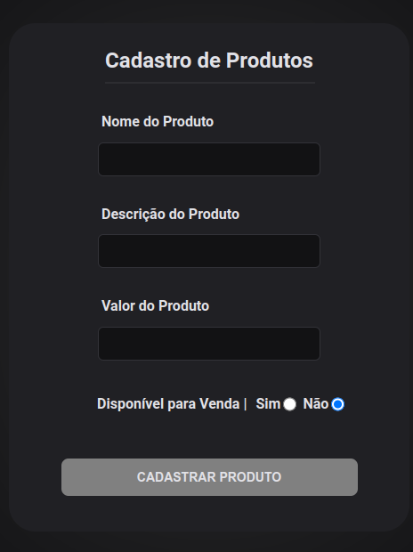

<h1 align="center"> Lista de Cadastro </h1>

  <a href="#-tecnologias">Tecnologias</a>&nbsp;&nbsp;&nbsp;|&nbsp;&nbsp;&nbsp;
  <a href="#-projeto">Projeto</a>&nbsp;&nbsp;&nbsp;|&nbsp;&nbsp;&nbsp;
  <a href="https://lista-cadastro.vercel.app/">WebSite</a>&nbsp;&nbsp;&nbsp;|&nbsp;&nbsp;&nbsp;
  <a href="#memo-licença">Licença</a>

  

 

  

## 🚀 Tecnologias

Esse projeto foi desenvolvido com as seguintes tecnologias:

- HTML e CSS
- vanilla JavaScript

## 💻 Projeto
Projeto criado com intuito de realizar um processo seletivo para estágio.
É um sistema que realiza a captação de informações de um produto inseridos pelo usuário e o armazena em uma lista, a qual pode ser visualizada após adicionar qualquer produto a lista.
Requisitos:
- O campos de nome e descrição, aceitam somente textos.
- O campo de valor, aceita somente números.
- Todos os campos devem ser preenchidos para adicionar o produto a lista.
- Os produtos são ordenados em ordem crescente, baseado unicamente no valor atribuído no momento de registro do produto.

## :memo: Licença

Esse projeto está sob a licença MIT.
